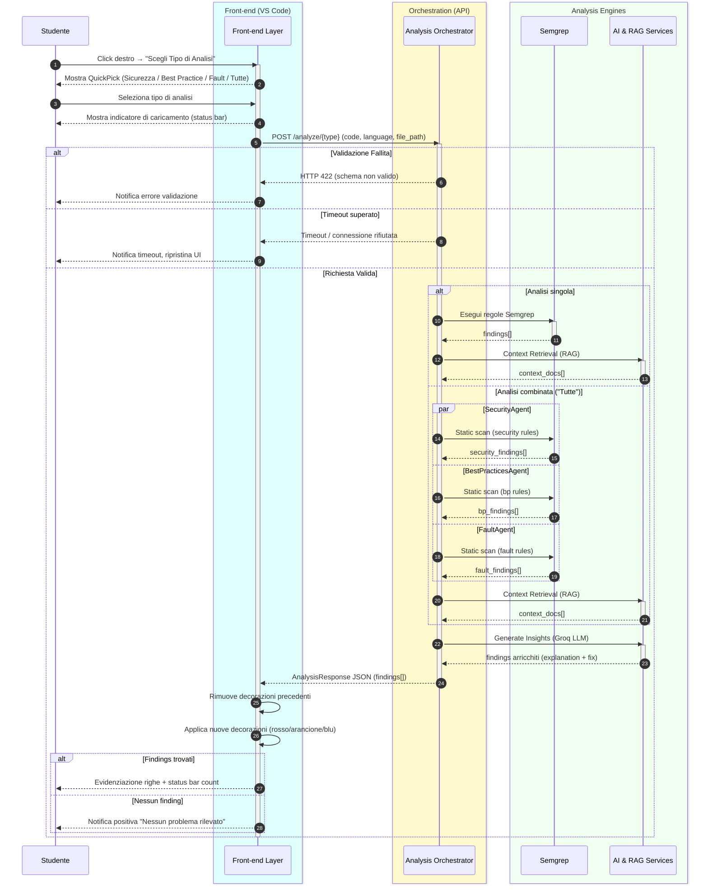
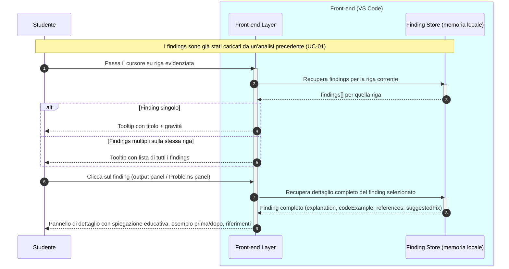
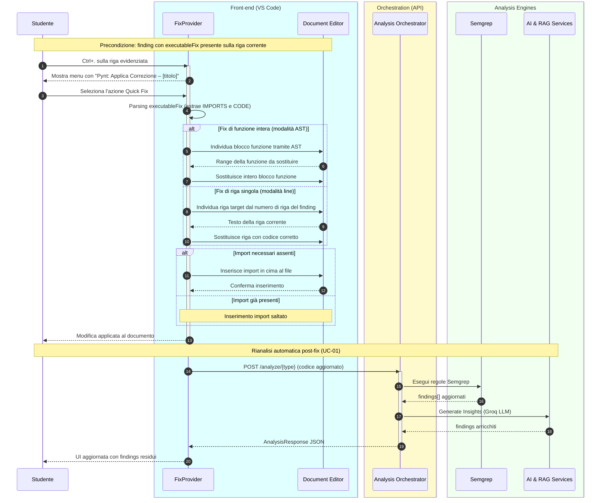
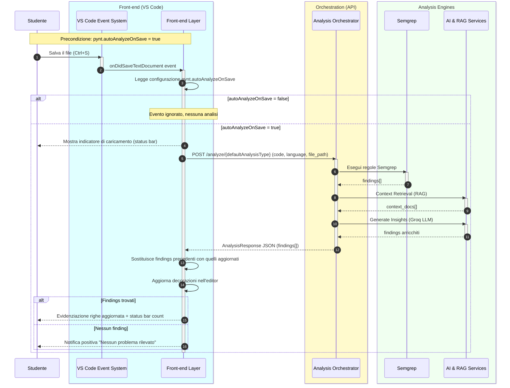

# Documento dei Requisiti - Pynt

**Versione:** 1.0
**Data:** Marzo 2026
**Tipo documento:** Software Requirements Specification (SRS)

---

## Indice

1. [Introduzione](#1-introduzione)
2. [Descrizione Generale](#2-descrizione-generale)
3. [Requisiti Funzionali](#3-requisiti-funzionali)
4. [Requisiti Non Funzionali](#4-requisiti-non-funzionali)
5. [Casi d'Uso](#5-casi-duso)
6. [Architettura del Sistema](#6-architettura-del-sistema)
7. [Vincoli e Dipendenze](#7-vincoli-e-dipendenze)

---

## 1. Introduzione

### 1.1 Scopo del Documento

Il presente documento specifica i requisiti funzionali e non funzionali del sistema **Pynt**, un'estensione educativa per Visual Studio Code che combina analisi statica del codice, modelli linguistici di grandi dimensioni (LLM) e tecniche di recupero aumentato dalla generazione (RAG) per fornire feedback intelligent e pedagogico agli studenti.

### 1.2 Ambito del Progetto

Pynt si rivolge principalmente a studenti di corsi universitari di informatica, con l'obiettivo di:

- Rilevare automaticamente vulnerabilità di sicurezza, cattive pratiche di programmazione ed errori logici nel codice sorgente.
- Fornire spiegazioni educative dettagliate che insegnino agli studenti *perché* un problema è rilevante, non solo *cosa* è sbagliato.
- Proporre correzioni eseguibili direttamente nell'editor, riducendo il ciclo di apprendimento.

### 1.3 Glossario

| Termine | Definizione |
|---------|-------------|
| **Finding** | Un singolo problema rilevato nel codice, con posizione, gravità e spiegazione |
| **LLM** | Large Language Model – modello di intelligenza artificiale per la comprensione del linguaggio naturale |
| **RAG** | Retrieval-Augmented Generation – tecnica che arricchisce il contesto di un LLM con documenti recuperati |
| **Semgrep** | Strumento open-source di analisi statica del codice basato su pattern matching |
| **Quick Fix** | Correzione automatica applicabile in-editor con un clic |
| **Agente** | Componente backend specializzato in un tipo di analisi |
| **FAISS** | Libreria per la ricerca efficiente di similarità su vettori ad alta dimensionalità |

### 1.4 Riferimenti

- Visual Studio Code Extension API: https://code.visualstudio.com/api
- OWASP Top 10: https://owasp.org/www-project-top-ten/
- PEP 8 – Style Guide for Python Code: https://peps.python.org/pep-0008/
- Semgrep Documentation: https://semgrep.dev/docs/

---

## 2. Descrizione Generale

### 2.1 Contesto del Sistema

Pynt è composto da due sottosistemi:

1. **Estensione VS Code (frontend):** interfaccia utente integrata nell'editor, realizzata in TypeScript.
2. **Server di analisi (backend):** servizio HTTP sviluppato in Python con FastAPI, responsabile dell'analisi del codice e della generazione del feedback.

La comunicazione avviene tramite API REST. L'estensione invia il codice sorgente al server, che restituisce una lista strutturata di findings con spiegazioni ed eventuali correzioni.

### 2.2 Caratteristiche degli Utenti

| Tipo utente | Descrizione |
|-------------|-------------|
| **Studente** | Utente principale. Scrive codice in VS Code e riceve feedback educativo tramite l'estensione. Conoscenza tecnica base. |
| **Docente/Tutor** | Configura il server e le tipologie di analisi abilitate. Può estendere le regole Semgrep. |
| **Amministratore di sistema** | Installa e mantiene il server backend, gestisce le chiavi API. |

### 2.3 Assunzioni e Dipendenze

- L'utente ha installato Visual Studio Code (versione ≥ 1.74).
- Il server backend è raggiungibile dall'estensione sulla rete locale o remota.
- Il server ha accesso alle API Groq per l'inferenza LLM.
- Per l'analisi di progetti, il percorso del workspace è accessibile dal server.

---

## 3. Requisiti Funzionali

I requisiti funzionali sono organizzati per macro-area e identificati con il codice `RF-<area>-<numero>`.

---

### 3.1 Analisi del Codice

**RF-AN-01 – Analisi di sicurezza**
Il sistema deve analizzare il file corrente per rilevare le seguenti categorie di vulnerabilità:
- SQL Injection (query costruite con concatenazione di stringhe o f-string)
- Uso non sicuro di `eval()` e `exec()`
- Segreti hardcoded (chiavi API, password, token nel codice sorgente)
- Deserializzazione non sicura (es. `pickle.loads` su dati non fidati)
- Path traversal (uso non validato di percorsi forniti dall'utente)
- Ulteriori vulnerabilità del catalogo OWASP Top 10

**RF-AN-02 – Analisi delle best practice**
Il sistema deve analizzare il file corrente per rilevare deviazioni da:
- PEP 8 (convenzioni di stile Python)
- Idiomi Pythonic (uso preferito di costrutti nativi del linguaggio)
- Principi SOLID e DRY
- Convenzioni di naming (variabili, funzioni, classi)
- Argomenti di default mutabili nelle funzioni

**RF-AN-03 – Rilevamento di fault**
Il sistema deve analizzare il file corrente per rilevare potenziali errori a runtime:
- `NameError` (variabili non definite usate prima dell'assegnazione)
- `TypeError` (operazioni tra tipi incompatibili)
- `IndexError` / `KeyError` (accessi fuori range o a chiavi inesistenti)
- Divisione per zero
- Cicli infiniti (condizioni di terminazione mai soddisfatte)
- Late binding nelle closure

**RF-AN-04 – Analisi combinata**
Il sistema deve offrire la possibilità di eseguire tutte e tre le analisi in parallelo con un'unica azione, restituendo i risultati unificati.

**RF-AN-05 – Supporto multi-linguaggio**
Il sistema deve supportare l'analisi di file nei linguaggi: Python, JavaScript/TypeScript, Java, C/C++. L'analisi LLM deve adattarsi al linguaggio del file in input.

---

### 3.2 Presentazione dei Risultati

**RF-PR-01 – Evidenziazione in-editor**
Il sistema deve evidenziare le righe di codice interessate da un finding, utilizzando colori distinti per livello di gravità:
- Rosso: `ERROR` (vulnerabilità critiche o defect gravi)
- Arancione: `WARNING` (possibili problemi o cattive pratiche)
- Blu: `INFO` (suggerimenti di miglioramento)

**RF-PR-02 – Tooltip hover**
Passando il cursore su una riga evidenziata, il sistema deve mostrare un tooltip con il titolo del problema e la gravità. In presenza di più findings sulla stessa riga, tutti devono essere elencati.

**RF-PR-03 – Pannello di dettaglio**
Il sistema deve fornire un pannello (webview o output panel) che mostri, per ogni finding:
- Posizione (file, riga, colonna)
- Livello di gravità
- Messaggio descrittivo sintetico
- Spiegazione educativa dettagliata
- Esempio di codice (prima e dopo la correzione)
- Riferimenti a documentazione esterna (OWASP, CWE, PEP, ecc.)
- Suggerimento di correzione in linguaggio naturale

**RF-PR-04 – Persistenza per scheda**
Il sistema deve mantenere i risultati dell'analisi associati al file aperto. Passando da un file a un altro e tornando al precedente, i findings devono essere ancora visibili senza dover rieseguire l'analisi.

---

### 3.3 Quick Fix

**RF-QF-01 – Disponibilità dell'azione**
Per ogni finding che include una correzione eseguibile (`executableFix`), il sistema deve esporre un'azione "Quick Fix" accessibile tramite il menu contestuale delle azioni codice di VS Code (lampadina / `Ctrl+.`).

**RF-QF-02 – Applicazione della correzione**
All'attivazione del Quick Fix, il sistema deve:
1. Identificare la riga target del finding nel documento corrente.
2. Sostituire la riga (o la funzione, in caso di fix che ridefinisce un'intera funzione) con il codice corretto.
3. Inserire eventuali import mancanti necessari al fix, verificando preventivamente che non siano già presenti.

**RF-QF-03 – Rianalisi automatica post-fix**
Dopo l'applicazione di un Quick Fix, il sistema deve automaticamente rilanciare l'analisi del file per aggiornare i findings rimanenti.

**RF-QF-04 – Assenza di Quick Fix**
In assenza di `executableFix` per un finding, il sistema non deve mostrare l'azione Quick Fix per quel finding.

---

### 3.4 Modalità di Attivazione dell'Analisi

**RF-AT-01 – Comando da menu contestuale**
L'utente deve poter avviare l'analisi tramite click destro sul file aperto e selezione della voce "Scegli Tipo di Analisi".

**RF-AT-02 – Pulsante nella barra di stato**
Il sistema deve mostrare un pulsante nella status bar di VS Code che consenta di avviare rapidamente l'analisi del file corrente.

**RF-AT-03 – Analisi automatica al salvataggio**
Il sistema deve supportare l'opzione di eseguire automaticamente l'analisi ogni volta che il file viene salvato. Questa modalità deve essere attivabile/disattivabile dalla configurazione dell'estensione.

---

### 3.5 Configurazione

**RF-CF-01 – URL del server**
L'utente deve poter configurare l'URL del server backend tramite l'impostazione `pynt.serverUrl` (default: `http://localhost:8000`).

**RF-CF-02 – Analisi automatica al salvataggio**
L'utente deve poter configurare `pynt.autoAnalyzeOnSave` (default: `false`) per abilitare o disabilitare l'analisi automatica.

**RF-CF-03 – Tipo di analisi predefinita**
L'utente deve poter configurare `pynt.defaultAnalysisType` per impostare il tipo di analisi predefinita (`security`, `best-practices`, `fault-detection`, `all`).

---

### 3.6 Backend – Pipeline di Analisi

**RF-BE-01 – Analisi statica con Semgrep**
Il backend deve eseguire Semgrep con regole personalizzate YAML per identificare pattern problematici nel codice. Il timeout dell'esecuzione deve essere configurabile (default: 30 secondi).

**RF-BE-02 – Arricchimento con LLM**
I risultati di Semgrep devono essere processati da un LLM (Groq API, modello Llama 3.3-70b) per generare spiegazioni educative, esempi di codice e correzioni eseguibili.

**RF-BE-03 – Rotazione delle chiavi API**
Il backend deve supportare più chiavi API Groq e ruotare automaticamente alla chiave successiva in caso di raggiungimento del limite di rate.

**RF-BE-04 – Contesto RAG**
Il backend deve supportare l'indicizzazione di un intero progetto con embedding HuggingFace e ricerca semantica FAISS per arricchire il contesto inviato all'LLM con codice correlato del progetto.

**RF-BE-05 – API REST**
Il backend deve esporre i seguenti endpoint:


| Metodo | Endpoint | Descrizione |
|--------|----------|-------------|
| POST | `/analyze/security` | Analisi vulnerabilità di sicurezza |
| POST | `/analyze/best-practices` | Analisi best practice |
| POST | `/analyze/fault-detection` | Rilevamento fault |
| POST | `/analyze/all` | Tutte e tre le analisi in parallelo |
| GET | `/health` | Health check del servizio |
| GET | `/` | Informazioni di base sul servizio |

---

## 4. Requisiti Non Funzionali

I requisiti non funzionali sono identificati con il codice `RNF-<area>-<numero>`.

---

### 4.1 Prestazioni

**RNF-PE-01 – Tempo di risposta dell'analisi singola**
Un'analisi singola (sicurezza, best practice o fault) deve completarsi entro 30 secondi per file di dimensioni tipiche (fino a 500 righe di codice).

**RNF-PE-02 – Analisi parallela**
L'analisi combinata (`/analyze/all`) deve eseguire i tre agenti in parallelo. Il tempo totale non deve essere significativamente superiore al tempo della singola analisi più lenta.

**RNF-PE-03 – Lazy loading del modello**
Il client LLM deve essere inizializzato solo alla prima richiesta di analisi, non all'avvio del server, per minimizzare il tempo di startup.

**RNF-PE-04 – Concorrenza**
Il server deve gestire fino a 5 richieste di analisi concorrenti senza degrado delle prestazioni.

---

### 4.2 Usabilità

**RNF-US-01 – Integrazione trasparente**
L'estensione deve integrarsi nell'ambiente VS Code senza richiedere all'utente di uscire dall'editor o aprire terminali.

**RNF-US-02 – Feedback visivo durante l'analisi**
Durante l'elaborazione, il sistema deve mostrare un indicatore di progresso (es. spinner nella status bar o notifica) per informare l'utente che l'analisi è in corso.

**RNF-US-03 – Messaggi di errore comprensibili**
In caso di errore (server non raggiungibile, timeout, ecc.), il sistema deve mostrare un messaggio in italiano che descriva il problema e indichi una possibile soluzione.

**RNF-US-04 – Lingua dell'interfaccia**
L'interfaccia utente, le voci di menu e i messaggi dell'estensione devono essere in italiano. Le spiegazioni educative nei findings devono essere bilingui (italiano e inglese).

---

### 4.3 Affidabilità

**RNF-AF-01 – Gestione dei timeout**
In caso di mancata risposta del server entro il timeout configurato, l'estensione deve notificare l'utente e ripristinare lo stato dell'interfaccia senza bloccarsi.

**RNF-AF-02 – Isolamento degli agenti**
Il fallimento di un agente (es. errore nell'analisi di sicurezza) non deve impedire l'esecuzione degli altri agenti nell'analisi combinata.

**RNF-AF-03 – Logging degli errori**
Il backend deve registrare gli errori su file di log persistente, con traccia completa dello stack, per facilitare il debug.

---

### 4.4 Manutenibilità

**RNF-MA-01 – Architettura a plugin per gli agenti**
Il backend deve utilizzare una classe base astratta (`BaseAgent`) da cui ereditano tutti gli agenti, per consentire l'aggiunta di nuovi tipi di analisi senza modificare il core del sistema.

**RNF-MA-02 – Regole Semgrep esternalizzate**
Le regole di analisi statica devono essere definite in file YAML separati, modificabili senza ricompilare il backend.

**RNF-MA-03 – Configurazione tramite variabili d'ambiente**
Tutti i parametri di configurazione sensibili (chiavi API, porte, modello LLM) devono essere gestiti tramite variabili d'ambiente (file `.env`), non hardcodati nel sorgente.

---

### 4.5 Sicurezza

**RNF-SI-01 – Protezione delle chiavi API**
Le chiavi API Groq non devono mai essere incluse nel codice sorgente versionato. Devono essere caricate esclusivamente da variabili d'ambiente.

**RNF-SI-02 – Validazione dell'input**
Il backend deve validare tutti i dati in ingresso tramite schemi Pydantic prima di processarli, rifiutando richieste malformate con codice HTTP 422.

**RNF-SI-03 – Esecuzione sandboxed di Semgrep**
Semgrep deve essere eseguito con limiti di risorse configurabili (memoria massima: 4 GB, timeout: 30 secondi) per evitare esaurimento delle risorse del server.

---

### 4.6 Portabilità

**RNF-PO-01 – Sistema operativo**
L'estensione VS Code deve funzionare su Windows, macOS e Linux. Il backend deve essere deployabile su qualsiasi sistema con Python 3.11+ e supporto POSIX.

**RNF-PO-02 – Indipendenza dalla versione di VS Code**
L'estensione deve essere compatibile con VS Code versione 1.74 e successive.

---

## 5. Casi d'Uso

### 5.1 Diagramma degli Attori

```
┌─────────────────┐       ┌──────────────────────────┐
│    Studente      │──────▶│    Estensione VS Code     │
└─────────────────┘       └──────────┬───────────────┘
                                     │ HTTP REST
                          ┌──────────▼───────────────┐
┌─────────────────┐       │    Server FastAPI          │
│    Docente       │──────▶│  (Agenti + Semgrep + RAG) │
└─────────────────┘       └──────────────────────────┘
```

---

### 5.2 UC-01 – Analizzare il File Corrente

**Attore primario:** Studente
**Precondizioni:** Il file è aperto in VS Code; il server backend è in esecuzione e raggiungibile.
**Postcondizioni:** I findings sono visualizzati nell'editor con evidenziazione e il pannello di dettaglio è aggiornato.

**Flusso principale:**
1. Lo studente fa click destro sul codice e seleziona "Scegli Tipo di Analisi".
2. Viene mostrata una lista con le opzioni: Sicurezza, Best Practice, Rilevamento Fault, Tutte.
3. Lo studente seleziona il tipo desiderato.
4. L'estensione mostra un indicatore di caricamento.
5. L'estensione invia il contenuto del file al server backend.
6. Il server esegue Semgrep, arricchisce con LLM (ed eventualmente RAG) e restituisce i findings.
7. L'estensione rimuove le decorazioni precedenti e applica le nuove.
8. Le righe interessate vengono evidenziate con il colore corrispondente alla gravità.
9. Il numero di problemi trovati viene mostrato nella status bar.

**Flussi alternativi:**
- **3a.** Se lo studente seleziona "Tutte", i tre agenti vengono eseguiti in parallelo.
- **6a.** Se il server restituisce un errore, l'estensione notifica l'utente con un messaggio descrittivo.
- **6b.** Se il timeout viene superato, l'estensione annulla la richiesta e notifica l'utente.
- **9a.** Se non vengono trovati problemi, viene mostrato un messaggio di conferma positivo.

**Sequence Diagram:**



---

### 5.3 UC-02 – Visualizzare il Dettaglio di un Finding

**Attore primario:** Studente
**Precondizioni:** Almeno un finding è presente nell'editor.
**Postcondizioni:** Il pannello di dettaglio mostra la spiegazione educativa completa del finding selezionato.

**Flusso principale:**
1. Lo studente passa il cursore sopra una riga evidenziata.
2. Appare un tooltip con titolo e gravità del finding (o lista di findings se multipli).
3. Lo studente clicca sul finding nel pannello dei findings o nell'output channel.
4. Vengono mostrati: spiegazione educativa, esempio di codice prima/dopo, riferimenti, suggerimento testuale.

**Sequence Diagram:**



---

### 5.4 UC-03 – Applicare un Quick Fix

**Attore primario:** Studente
**Precondizioni:** Un finding con `executableFix` è presente sulla riga del cursore.
**Postcondizioni:** Il codice è stato corretto; eventuali import necessari sono stati aggiunti; l'analisi viene rilanciata.

**Flusso principale:**
1. Lo studente posiziona il cursore sulla riga evidenziata.
2. Preme `Ctrl+.` (o clicca sull'icona lampadina).
3. Viene mostrato il menu con l'azione "Pynt: Applica Correzione – [titolo del finding]".
4. Lo studente seleziona l'azione.
5. L'estensione identifica se il fix sostituisce una funzione intera (modalità AST) o una singola riga (modalità line).
6. Il sistema verifica se gli import necessari sono già presenti; se non lo sono, li aggiunge in cima al file.
7. La riga (o funzione) target viene sostituita con il codice corretto.
8. Viene rilanciata automaticamente l'analisi per aggiornare i findings residui.

**Flussi alternativi:**
- **5a.** Se il fix riguarda un intero blocco funzione, viene identificato tramite AST e sostituito interamente.
- **6a.** Se l'import è già presente, il passo viene saltato.

**Sequence Diagram:**



---

### 5.5 UC-04 – Analisi Automatica al Salvataggio

**Attore primario:** Studente
**Precondizioni:** L'opzione `pynt.autoAnalyzeOnSave` è impostata a `true`.
**Postcondizioni:** I findings vengono aggiornati ogni volta che il file viene salvato.

**Flusso principale:**
1. Lo studente modifica il codice e salva il file (`Ctrl+S`).
2. L'estensione rileva l'evento di salvataggio.
3. Viene avviata automaticamente l'analisi con il tipo predefinito configurato.
4. I findings precedenti vengono sostituiti con quelli aggiornati.

**Sequence Diagram:**



---

### 5.6 UC-05 – Configurare il Sistema

**Attore primario:** Studente / Docente
**Precondizioni:** VS Code è installato con l'estensione Pynt.
**Postcondizioni:** Le impostazioni vengono salvate e applicate alla sessione corrente e alle successive.

**Flusso principale:**
1. L'utente apre le impostazioni di VS Code (`Ctrl+,`).
2. Cerca "Pynt" nel pannello delle impostazioni.
3. Modifica uno o più dei seguenti parametri: URL del server, analisi automatica al salvataggio, tipo di analisi predefinita.
4. Le modifiche vengono applicate immediatamente senza riavviare l'estensione.

---

### 5.7 UC-06 – Aggiungere Regole di Analisi Personalizzate

**Attore primario:** Docente
**Precondizioni:** Accesso al filesystem del server backend.
**Postcondizioni:** Le nuove regole vengono utilizzate nelle analisi successive.

**Flusso principale:**
1. Il docente apre il file `server/analyzers/rules/python_rules.yaml`.
2. Aggiunge nuove regole nel formato Semgrep YAML.
3. Salva il file.
4. Le nuove regole sono attive alla successiva richiesta di analisi (senza riavvio del server).

---

## 6. Architettura del Sistema

### 6.1 Componenti Principali

```
┌──────────────────────────────────────────────────────┐
│                  VS Code Extension                   │
│                                                      │
│  ┌──────────────┐  ┌─────────────┐  ┌─────────────┐ │
│  │ extension.ts │  │decorators.ts│  │FixProvider.ts│ │
│  │ (orchestratore)│  │(evidenziaz.)│  │(quick fix)  │ │
│  └──────┬───────┘  └─────────────┘  └─────────────┘ │
│         │                                            │
│  ┌──────▼───────┐                                    │
│  │  analyzer.ts │ ← HTTP client (Axios)              │
│  └──────┬───────┘                                    │
└─────────┼────────────────────────────────────────────┘
          │ REST API
┌─────────▼────────────────────────────────────────────┐
│                  FastAPI Server                       │
│                                                      │
│  ┌──────────────────────────────────────────────┐    │
│  │                main.py (Router)               │    │
│  └──────┬──────────────┬──────────────┬─────────┘    │
│         │              │              │              │
│  ┌──────▼──────┐ ┌─────▼──────┐ ┌────▼──────────┐   │
│  │SecurityAgent│ │BPAgent     │ │FaultAgent     │   │
│  └──────┬──────┘ └─────┬──────┘ └────┬──────────┘   │
│         └──────────────┴─────────────┘              │
│                      │                              │
│              ┌───────▼────────┐                     │
│              │   BaseAgent    │                     │
│              │  ┌──────────┐  │                     │
│              │  │ Semgrep  │  │                     │
│              │  │Analyzer  │  │                     │
│              │  └──────────┘  │                     │
│              │  ┌──────────┐  │                     │
│              │  │   RAG    │  │                     │
│              │  │ Service  │  │                     │
│              │  └──────────┘  │                     │
│              │  ┌──────────┐  │                     │
│              │  │   LLM    │  │                     │
│              │  │ (Groq)   │  │                     │
│              │  └──────────┘  │                     │
│              └────────────────┘                     │
└──────────────────────────────────────────────────────┘
```

### 6.2 Pipeline di Analisi

La pipeline eseguita da `BaseAgent` per ogni richiesta di analisi è la seguente:

```
Input: codice sorgente + tipo di analisi + percorso file
         │
         ▼
1. SEMGREP (analisi statica)
   └─ Esecuzione con regole YAML personalizzate
   └─ Output: lista di match con riga, regola, severità
         │
         ▼
2. RAG (opzionale, se workspace disponibile)
   └─ Ricerca semantica nel codice del progetto
   └─ Recupero frammenti di codice correlati
   └─ Output: contesto aggiuntivo per l'LLM
         │
         ▼
3. LLM (Groq – Llama 3.3-70b)
   └─ Prompt strutturato con risultati Semgrep + contesto RAG
   └─ Generazione di findings arricchiti con:
       ├─ educationalExplanation
       ├─ codeExample (prima/dopo)
       ├─ references
       ├─ suggestedFix
       └─ executableFix (IMPORTS + CODE)
         │
         ▼
Output: AnalysisResponse (JSON)
```

### 6.3 Modello dei Dati

**Richiesta di analisi (`AnalysisRequest`):**

| Campo | Tipo | Descrizione |
|-------|------|-------------|
| `code` | string | Contenuto del file da analizzare |
| `language` | string | Linguaggio di programmazione rilevato |
| `file_path` | string (opzionale) | Percorso del file nel workspace |
| `project_path` | string (opzionale) | Radice del progetto per RAG |

**Finding (`Finding`):**

| Campo | Tipo | Descrizione |
|-------|------|-------------|
| `line` | int | Numero di riga del problema |
| `column` | int | Numero di colonna |
| `severity` | enum | `ERROR` \| `WARNING` \| `INFO` |
| `message` | string | Titolo sintetico |
| `educationalExplanation` | string | Spiegazione didattica dettagliata |
| `suggestedFix` | string | Suggerimento testuale |
| `executableFix` | string (opzionale) | Codice di correzione (IMPORTS + CODE) |
| `codeExample` | string | Esempio prima/dopo |
| `references` | list[string] | Link a documentazione |

**Risposta di analisi (`AnalysisResponse`):**

| Campo | Tipo | Descrizione |
|-------|------|-------------|
| `findings` | list[Finding] | Lista dei problemi rilevati |
| `analysis_type` | string | Tipo di analisi eseguita |
| `file_path` | string | Percorso del file analizzato |
| `timestamp` | datetime | Data e ora dell'analisi |

---

## 7. Vincoli e Dipendenze

### 7.1 Dipendenze Software

**Backend (Python):**

| Libreria | Versione | Scopo |
|----------|----------|-------|
| FastAPI | ≥ 0.123 | Framework web |
| LangChain | ≥ 1.1.2 | Orchestrazione LLM |
| langchain-groq | ≥ 1.1.1 | Integrazione API Groq |
| Pydantic | ≥ 2.12 | Validazione dati |
| Semgrep | ≥ 1.149 | Analisi statica |
| faiss-cpu | ≥ 1.13.2 | Ricerca vettoriale |
| sentence-transformers | ≥ 5.0 | Embeddings HuggingFace |
| uvicorn | ≥ 0.38 | Server ASGI |

**Frontend (Node.js):**

| Pacchetto | Versione | Scopo |
|-----------|----------|-------|
| TypeScript | ≥ 5.0 | Linguaggio di sviluppo |
| @types/vscode | ≥ 1.74 | API VS Code |
| axios | ≥ 1.6 | Client HTTP |

### 7.2 Servizi Esterni

| Servizio | Utilizzo | Nota |
|----------|----------|------|
| **Groq API** | Inferenza LLM (Llama 3.3-70b) | Richiede chiave API |
| **HuggingFace Hub** | Download modello embedding (`all-MiniLM-L6-v2`) | Richiede connessione internet al primo avvio |

### 7.3 Vincoli Tecnici

- **VC-01:** Il modello LLM predefinito è `llama-3.3-70b-versatile` su Groq. La sostituzione con altri modelli richiede la modifica della variabile d'ambiente `DEFAULT_LLM_MODEL`.
- **VC-02:** Semgrep supporta nativamente l'analisi di Python, JavaScript/TypeScript, Java e C/C++. Linguaggi aggiuntivi richiedono regole Semgrep dedicate.
- **VC-03:** La funzionalità RAG richiede che il percorso del progetto sia accessibile dal processo server. Non è disponibile in modalità sandboxed.
- **VC-04:** Il limite di memoria per l'esecuzione di Semgrep è di 4 GB. File di grandi dimensioni o progetti con molti file potrebbero richiedere un aumento di questa soglia.

---

*Fine del documento.*
